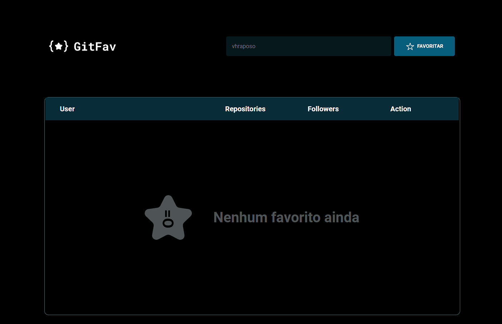
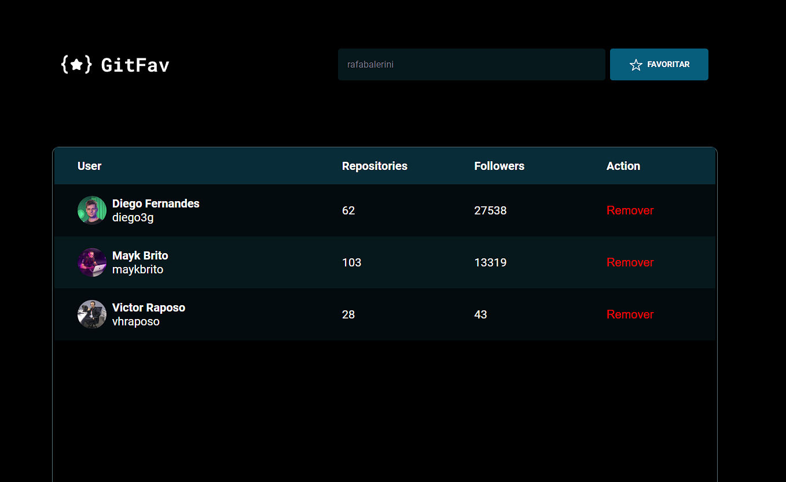

# GitFav - versão final 

- Projeto feito durante o estágio 6 do explorer 
- Utilização de HTML, CSS E Javascript 

- Estrutura de dados HTML
- Funções no Javascript
- Manipulação da DOM
- ES6 Modules
- Refatoração
- Funções assincronas 
 * Promisses
 * Async, await
- Consumo da api do github  

Deploy: https://vhraposo.github.io/gitfav/

Preview: 
<h2>Sem nenhum favorito</h2>

<h2>Após adicionar os favoritos</h2>

